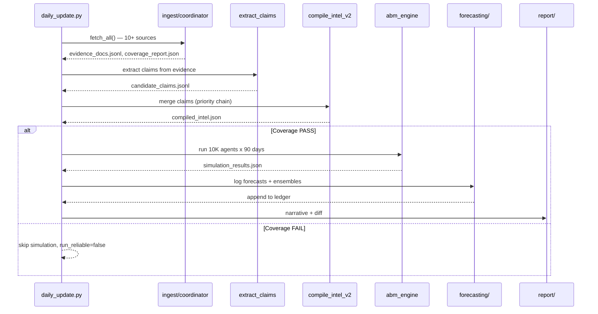
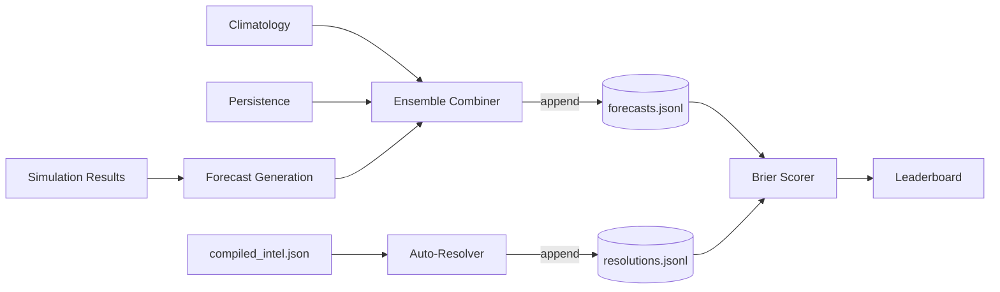
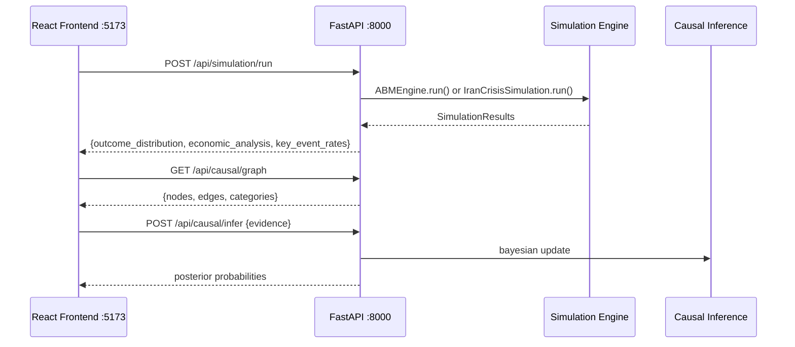

# Architecture

This document describes how the system works end-to-end, from raw intelligence collection through simulation to forecasting and visualization.

## Pipeline Overview

```
OSINT Sources (ISW, HRANA, Amnesty, BBC Persian, Bonbast, IODA, ...)
       │
       ▼
┌─────────────┐    evidence_docs.jsonl
│   Ingest    │──► source_index.json
│             │    coverage_report.json
└──────┬──────┘
       │
       ▼
┌─────────────┐    candidate_claims.jsonl
│   Extract   │    (GPT-4 claim extraction)
│   Claims    │
└──────┬──────┘
       │
       ▼
┌─────────────┐    compiled_intel.json
│   Compile   │──► merge_report.json
│   Intel     │    qa_report.json
└──────┬──────┘
       │
       ▼
┌─────────────┐    analyst_priors.json
│   Analyst   │──► priors_resolved.json
│   Priors    │    priors_qa.json
└──────┬──────┘
       │
       ├──────────────────┬─────────────────────┐
       ▼                  ▼                     ▼
┌────────────┐    ┌─────────────┐    ┌──────────────────┐
│ State-     │    │  ABM Engine │    │ Oracle Forecaster │
│ Machine MC │    │ (10K agents)│    │ (baselines +      │
│            │    │             │    │  ensembles)        │
└─────┬──────┘    └──────┬──────┘    └────────┬─────────┘
      │                  │                    │
      └────────┬─────────┘                    │
               ▼                              ▼
       simulation_results.json      forecasting/ledger/
               │                    (forecasts, resolutions,
               │                     corrections)
       ┌───────┴───────┐                    │
       ▼               ▼                    ▼
  Streamlit        React              Scorecard &
  Dashboard       Frontend            Leaderboard
```

## Daily Pipeline Sequence



## Stage 1: Evidence Ingestion

**Code:** `src/ingest/`

The coordinator (`coordinator.py`) runs 10+ source-specific fetchers in parallel. Each fetcher scrapes or queries a single source and returns structured evidence documents.

| Fetcher | Source | Data |
|---------|--------|------|
| `fetch_isw.py` | Institute for the Study of War | Think-tank analysis |
| `fetch_rss.py` | HRANA, Amnesty, HRW feeds | Human rights reporting |
| `fetch_bonbast.py` | Bonbast.com | Black-market Rial exchange rate |
| `fetch_ioda.py` | Georgia Tech IODA | Internet connectivity index |
| `fetch_ooni.py` | OONI | Censorship measurements |
| `fetch_tasnim.py` | Tasnim News | Regime media narrative |
| `fetch_web.py` | BBC Persian, TGJU, others | General web scraping |

**Coverage gates** (`coverage.py`) enforce rolling-window freshness per source bucket (36-72 hours depending on type). If critical buckets (osint_thinktank, ngo_rights, regime_outlets, persian_services) go stale, the run is flagged unreliable and simulation can be skipped.

**Source health** (`health.py`) tracks each source as OK, DEGRADED, or DOWN across runs.

## Stage 2: Claim Extraction

**Code:** `src/ingest/extract_claims.py`

Uses the GPT-4 API to extract discrete, schema-mapped factual claims from evidence documents. Each claim includes a `path` (dot-notation into the intel schema), a value, confidence score, and source references.

## Stage 3: Intel Compilation

**Code:** `src/pipeline/compile_intel_v2.py`

Merges claims into a single `compiled_intel.json` conforming to the project schema. When claims conflict (e.g., two sources report different Rial rates), a deterministic priority chain resolves the winner:

```
source_grade → triangulated → confidence → published_at → claim_id
```

Conflicts are logged in `merge_report.json`. A QA pass checks completeness.

**Baseline knowledge** (`src/pipeline/compile_baseline.py`) packages stable reference data (regime structure, protest history, ethnic composition) separately for analyst anchoring.

## Stage 4: Analyst Priors

Probability estimates are generated via the security analyst prompt (`prompts/02_security_analyst_prompt.md`), which reads both current intel and baseline knowledge to produce calibrated priors anchored to historical base rates.

Priors go through a contract validator (`src/priors/contract.py`) that enforces time-basis semantics (anchor points, window lengths, offset rules). Invalid priors fail fast.

## Stage 5: Simulation

Two simulation engines produce outcome distributions from the same inputs.

### State-Machine Monte Carlo (`src/simulation.py`)

Runs 10,000 day-by-day simulations over a 90-day horizon. Each run samples from prior distributions to determine daily event probabilities, then steps through state transitions:

- **5 terminal outcomes:** REGIME_SURVIVES_STATUS_QUO, REGIME_SURVIVES_WITH_CONCESSIONS, MANAGED_TRANSITION, REGIME_COLLAPSE_CHAOTIC, ETHNIC_FRAGMENTATION
- **Feedback loops:** Economic stress increases protest escalation (+20% at CRITICAL level). Concessions dampen escalation (x0.5) and defection (x0.7). Regional instability raises crackdown probability (+20%).
- **Regional cascade:** Iraq/Syria spillover, Israel strikes, and Gulf realignment are modeled as correlated processes.

### Agent-Based Model (`src/abm_engine.py`)

10,000 heterogeneous agents interact on a small-world network (8 neighbors, 10% rewiring):

| Agent Type | Share | Behavior |
|-----------|-------|----------|
| **Student** | 15% | Low activation threshold during escalation |
| **Merchant** | 20% | Graduated sensitivity to Rial collapse |
| **Conscript** | 10% | Can defect under protest pressure or moral injury |
| **Hardliner** | 5% | Loyal security; suppresses neighboring agents |
| **Civilian** | 50% | Standard Granovetter threshold with exhaustion |

Each simulation step processes: exhaustion decay, grievance updates, threshold adjustments, neighbor influence, activation decisions, and defection cascades. When >30% of conscripts defect, it triggers a macro regime crisis.

The ABM produces more volatile outcomes than the state machine due to network contagion effects:

| Metric | State Machine | ABM |
|--------|--------------|-----|
| Regime survives | ~83% | ~73% |
| Security defection | ~3% | ~8% |
| Ethnic uprising | ~9% | ~22% |
| Collapse risk | ~4% | ~7% |

## Stage 6: Oracle Forecasting

**Code:** `src/forecasting/`

A structured forecasting system that tracks predictions over time and scores them against outcomes.



### Event Catalog

`config/event_catalog.json` defines 18 events across three types:

- **Binary:** YES/NO (e.g., "Rial exceeds 1.2M")
- **Categorical:** Multiple discrete outcomes (e.g., internet status: FUNCTIONAL / PARTIAL / SEVERELY_DEGRADED / BLACKOUT)
- **Binned-continuous:** Numeric values mapped to bins (e.g., FX rate bands)

Each event specifies valid horizons (1, 7, 15, or 30 days), resolution rules, and whether it auto-resolves.

### Forecasters

Three forecast sources feed into ensembles:

1. **Simulation-derived** (`forecast.py`): Probabilities from MC/ABM output
2. **Climatology** (`baseline_history.py`): Dirichlet-smoothed historical frequencies — `p_k = (count_k + α) / (N + K·α)`
3. **Persistence** (`baseline_history.py`): Last resolved outcome with staleness decay — reverts to climatology as data ages

### Ensembles

`ensembles.py` combines forecasters with configurable weights (default: 60% simulation, 20% climatology, 20% persistence). If a member is missing, weights are renormalized among available members.

### Resolution & Scoring

- **Auto-resolution** (`resolver.py`): Checks compiled intel against event rules (threshold comparisons, enum matching, bin mapping)
- **Scoring** (`scorer.py`): Multinomial Brier score normalized to [0,1], log scores, calibration analysis
- **Leaderboard** (`reporter.py`): Compares forecasters per (event_type × horizon) slice

### Ledger

All forecasts, resolutions, and corrections are stored as append-only JSONL in `forecasting/ledger/`. This provides a complete audit trail.

## Stage 7: Reporting & Visualization

**Code:** `src/report/`

- `generate_report.py`: Narrative HTML/Markdown reports with outcome charts
- `generate_diff_report.py`: Run-to-run comparison (outcome shifts, coverage deltas, health transitions, contested claims)

## Frontend ↔ Backend Contract



**Invariant:** `frontend/` never imports from `src/`. Communication is HTTP-only.

## Dashboards

### Streamlit (`dashboard.py`)

- **Observe mode:** Browse past runs, view outcome distributions, event rates, diff reports
- **Simulate mode:** Run ad-hoc simulations with parameter overrides (defection probability, protest growth factor)

### React Frontend (`frontend/`)

War-room interface with:
- Regional map (province-level protest activity)
- Outcome distribution charts
- Causal explorer (interactive DAG)
- DEFCON widget (collapse probability indicator)
- Timeline slider (90-day trajectory scrubbing)

```
frontend/src/
├── components/
│   ├── controls/       # ControlPanel, ConfidenceSlider, RunSimulationButton
│   ├── layout/         # WarRoomLayout, Header, Sidebar, MainView
│   ├── status/         # DefconWidget
│   ├── timeline/       # TimelineSlider
│   ├── ui/             # Badge, Panel, StatCard, Skeleton, EmptyState
│   └── visualization/  # ExecutiveSummary, OutcomeChart, RegionalMap, CausalExplorer
├── data/               # Mock data, Iran map GeoJSON
├── services/           # API client (real + mock)
├── store/              # Zustand simulationStore
├── types/              # TypeScript interfaces
└── utils/              # Colors, formatters
```

## Configuration

| File | Purpose |
|------|---------|
| `config/event_catalog.json` | Event definitions, types, outcomes, resolution rules |
| `config/ensemble_config.json` | Forecaster weights and combination policy |
| `config/baseline_config.json` | History window, smoothing alpha, persistence stickiness |
| `config/ingest.yaml` | Source limits, retry policy, coverage-fail behavior |
| `config/path_registry_v2.json` | Environment-independent path resolution |
| `data/analyst_priors.json` | Calibrated probability estimates |
| `data/iran_crisis_intel.json` | Current situation snapshot |

## Run Artifacts

Each pipeline run produces a folder under `runs/RUN_YYYYMMDD_*/`:

```
runs/RUN_20260131_daily/
├── run_manifest.json         # Git hash, data cutoff, input file hashes, seed
├── coverage_report.json      # Source freshness status
├── compiled_intel.json       # Merged intelligence
├── priors_resolved.json      # Validated probability estimates
├── simulation_results.json   # Outcome distribution + event rates
├── diff_report.json          # Changes from previous run
├── scorecard.md              # Forecast leaderboard
└── report.html               # Human-readable summary
```

The `run_manifest.json` includes SHA-256 hashes of all inputs and an optional seed, enabling exact reproduction of any run.

## Architectural Invariants

1. **No circular deps** — `frontend/` and `src/` communicate only via HTTP or JSON contracts
2. **Stateless code** — `src/` contains no mutable state; all state lives in `data/`, `forecasting/ledger/`, or `runs/`
3. **Immutable ledger** — `forecasting/ledger/*.jsonl` is append-only, never overwritten
4. **Hermetic reproducibility** — every run produces `run_manifest.json` with SHA-256 input hashes and git commit
5. **Coverage gating** — simulation skipped when critical OSINT sources are stale
