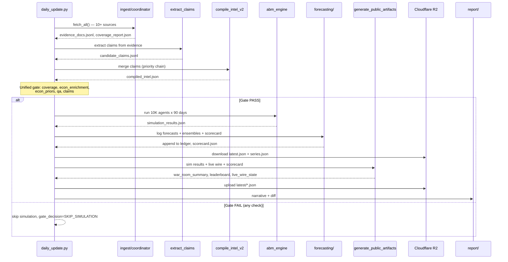
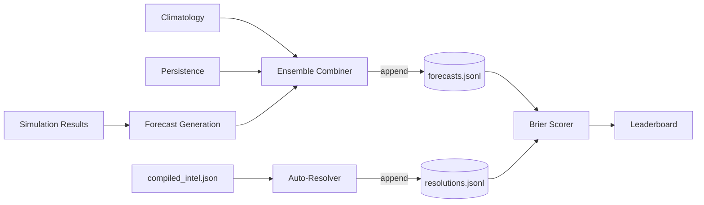

# Architecture

This document describes how the system works end-to-end, from raw intelligence collection through simulation to forecasting and visualization.

## Pipeline Overview

```
OSINT Sources (ISW, HRANA, Amnesty, BBC Persian, Bonbast, IODA, ...)
       │
       ▼
┌─────────────┐    evidence_docs.jsonl
│   Ingest    │──► source_index.json
│             │    coverage_report.json
└──────┬──────┘
       │
       ▼
┌─────────────┐    candidate_claims.jsonl
│   Extract   │    (GPT-4 claim extraction)
│   Claims    │
└──────┬──────┘
       │
       ▼
┌─────────────┐    compiled_intel.json
│   Compile   │──► merge_report.json
│   Intel     │    qa_report.json
└──────┬──────┘
       │
       ▼
┌─────────────┐    analyst_priors.json
│   Analyst   │──► priors_resolved.json
│   Priors    │    priors_qa.json
└──────┬──────┘
       │
       ├──────────────────┬─────────────────────┐
       ▼                  ▼                     ▼
┌────────────┐    ┌─────────────┐    ┌──────────────────┐
│ State-     │    │  ABM Engine │    │ Oracle Forecaster │
│ Machine MC │    │ (10K agents)│    │ (baselines +      │
│            │    │             │    │  ensembles)        │
└─────┬──────┘    └──────┬──────┘    └────────┬─────────┘
      │                  │                    │
      └────────┬─────────┘                    │
               ▼                              ▼
       simulation_results.json      forecasting/ledger/
               │                    (forecasts, resolutions,
               │                     corrections)
       ┌───────┴───────┐                    │
       ▼               ▼                    ▼
  Streamlit        React              Scorecard &
  Dashboard       Frontend            Leaderboard

                   ┌──────────────────────────────────────┐
                   │  Live Wire (6-hourly, independent)   │
                   │                                      │
                   │  R2 state ──► 4 signals ──► classify │
                   │              + quality    + hysteresis│
                   │                    │                  │
                   │                    ▼                  │
                   │  R2 latest/live_wire_state.json       │
                   └──────────────────────────────────────┘
                                       │
                   ┌───────────────────┼───────────────────┐
                   │  Daily: Public Artifact Generation    │
                   │                                       │
                   │  sim_results + live_wire + scorecard   │
                   │        │                              │
                   │        ▼                              │
                   │  R2: latest/war_room_summary.json     │
                   │  R2: latest/leaderboard.json          │
                   │  R2: latest/live_wire_state.json      │
                   └───────────────────────────────────────┘
                                       │
                                       ▼
                              React staticDataService
                             (typed fetch from R2)
```

## Daily Pipeline Sequence



## Stage 1: Evidence Ingestion

**Code:** `src/ingest/`

The coordinator (`coordinator.py`) runs 10+ source-specific fetchers in parallel. Each fetcher extends `BaseFetcher` and reads its endpoint URL from `config/sources.yaml` via `_require_url()` — no hardcoded URLs or silent fallbacks. Missing config raises `ConfigError` (non-retriable).

| Fetcher | Source | Data |
|---------|--------|------|
| `fetch_isw.py` | Institute for the Study of War | Think-tank analysis |
| `fetch_rss.py` | HRANA, Amnesty, HRW feeds | Human rights reporting |
| `fetch_bonbast.py` | Bonbast.com | Black-market Rial exchange rate |
| `fetch_nobitex.py` | Nobitex exchange | USDT/IRR crypto rate (primary FX signal) |
| `fetch_ioda.py` | Georgia Tech IODA | Internet connectivity index |
| `fetch_ooni.py` | OONI | Censorship measurements |
| `fetch_tasnim.py` | Tasnim News | Regime media narrative |
| `fetch_web.py` | BBC Persian, TGJU, others | General web scraping |

**Coverage gates** (`coverage.py`) enforce rolling-window freshness per source bucket (36-72 hours depending on type). If critical buckets (osint_thinktank, ngo_rights, regime_outlets, persian_services) go stale, the run is flagged unreliable and simulation can be skipped.

**Source health** (`health.py`) tracks each source as OK, DEGRADED, or DOWN across runs.

## Live Wire Pipeline (6-hourly, independent)

**Code:** `src/ingest/live_wire/`

The Live Wire pipeline runs every 6 hours via `.github/workflows/live_wire.yml`, independently of the daily simulation pipeline. It fetches 4 real-time signals and produces a classified state for the war room.

**Signals:**

| Signal | Source | Module | Units |
|--------|--------|--------|-------|
| USDT/IRR rate | Nobitex | `fetch_nobitex.py` | IRR (primary economic signal) |
| Rial/USD rate | Bonbast | `fetch_bonbast.py` | IRR (fallback proxy) |
| Connectivity index | IODA | `fetch_ioda.py` | 0-100 scale |
| News volume | GDELT | `live_wire/fetch_gdelt.py` | 24h article count (tone=null) |

**Processing stages:**

1. **Signal quality** (`signal_quality.py`): Tracks OK/STALE/FAILED per signal. Uses `source_timestamp_utc` when the API provides it (Nobitex, IODA); falls back to `fetched_at_utc` (Bonbast, GDELT). On failure, carries `last_good_value` — never fabricates.
2. **Smoothing** (`smoothing.py`): EMA with configurable alpha (0.3). Injects last-good value for failed signals before averaging.
3. **Classification** (`rule_engine.py`): Thresholds from `config/live_wire.json` (never hardcoded). Economic stress: STABLE/PRESSURED/CRITICAL. Internet: FUNCTIONAL/PARTIAL/SEVERELY_DEGRADED/BLACKOUT. News: NORMAL/ELEVATED/SURGE. All return `None` on `None` input.
4. **Hysteresis** (`rule_engine.py`): State must sustain N consecutive cycles (configurable, default 3) before transitioning.
5. **Runner** (`runner.py`): Orchestrates the above. Downloads state from R2, fetches signals, processes, writes `data/live_wire/latest.json` + `series.json`, uploads to R2.

**State persistence:** R2 bucket is the sole source of truth. Local `data/live_wire/` files are ephemeral CI working copies (.gitignored). State includes snapshot counter (monotonic IDs), signal qualities, hysteresis counters, and EMA values.

## Stage 2: Claim Extraction

**Code:** `src/ingest/extract_claims.py`

Uses the GPT-4 API to extract discrete, schema-mapped factual claims from evidence documents. Each claim includes a `path` (dot-notation into the intel schema), a value, confidence score, and source references.

## Stage 3: Intel Compilation

**Code:** `src/pipeline/compile_intel_v2.py`

Merges claims into a single `compiled_intel.json` conforming to the project schema. When claims conflict (e.g., two sources report different Rial rates), a deterministic priority chain resolves the winner:

```
source_grade → triangulated → confidence → published_at → claim_id
```

Conflicts are logged in `merge_report.json`. A QA pass checks completeness.

**Economic enrichment** (`scripts/enrich_economic_data.py`) runs after compilation to inject live Bonbast data (Rial/USD, Rial/EUR, gold prices) and seed a baseline inflation estimate (42% SCI anchor, 2025–2026 range) when claim extraction hasn't provided one. The script loads its Bonbast config from `config/sources.yaml` via `_load_source_config()` — consistent with the no-hardcoded-URLs invariant.

**Baseline knowledge** (`src/pipeline/compile_baseline.py`) packages stable reference data (regime structure, protest history, ethnic composition) separately for analyst anchoring.

## Stage 4: Analyst Priors

Probability estimates are generated via the security analyst prompt (`prompts/02_security_analyst_prompt.md`), which reads both current intel and baseline knowledge to produce calibrated priors anchored to historical base rates.

Priors go through a contract validator (`src/priors/contract.py`) that enforces time-basis semantics (anchor points, window lengths, offset rules). Invalid priors fail fast.

## Stage 4.5: Unified Pre-Simulation Gate

**Code:** `scripts/daily_update.py` — `validate_econ_priors()` + gate logic

Before simulation runs, a unified gate checks 5 independent conditions. If any returns FAIL, the simulation is skipped entirely and the run manifest records `gate_decision=SKIP_SIMULATION`.

| Gate key | What it checks | FAIL condition |
|----------|---------------|----------------|
| `coverage` | Source freshness per bucket | Critical buckets stale (when `on_coverage_fail=skip_simulation`) |
| `econ_enrichment` | Economic data enrichment | `enrich_economic_data.py` exits non-zero (loads Bonbast config from `sources.yaml` via `_load_source_config()`) |
| `econ_priors` | `analyst_priors.json` economic config | Missing/invalid `economic_thresholds` or `economic_modifiers` |
| `qa` | Compiled intel QA | Schema violations, duplicate claim IDs, unexplained null values |
| `claims` | Claim extraction | API key set + 0 claims extracted (auto-ingest only) |

### Economic priors validation (`validate_econ_priors`)

Validates more than key presence:
- `economic_thresholds` must be a dict with 4 required sub-keys
- Values must be numeric (castable to int/float)
- Threshold ordering enforced: `rial_pressured < rial_critical`, `inflation_pressured < inflation_critical`
- `economic_modifiers` must be a dict

### No silent fallbacks

`src/simulation.py:_get_economic_stress()` raises `ValueError` with the missing field name if economic data is absent from intel or priors. This is a defense-in-depth safety net — the gate prevents it from being reached in production. Prior to Sprint 2, missing data was silently replaced with hardcoded values (`rial_rate=1,000,000`, `inflation=35`).

### Pipeline stage execution

Each pipeline stage is wrapped in `run_stage()` which returns a `StageResult` dataclass:
- Exit 0 → `OK`
- Exit 2 → `FAIL` (soft fail, pipeline continues to gate)
- Timeout → `TIMEOUT` (fatal for simulation/report stages)
- Other → `CRASH` (fatal)

## Stage 5: Simulation

Two simulation engines produce outcome distributions from the same inputs.

### State-Machine Monte Carlo (`src/simulation.py`)

Runs 10,000 day-by-day simulations over a 90-day horizon. Each run samples from prior distributions to determine daily event probabilities, then steps through state transitions:

- **5 terminal outcomes:** REGIME_SURVIVES_STATUS_QUO, REGIME_SURVIVES_WITH_CONCESSIONS, MANAGED_TRANSITION, REGIME_COLLAPSE_CHAOTIC, ETHNIC_FRAGMENTATION
- **US intervention tiers:** Postures are split into *soft* (INFORMATION_OPS, ECONOMIC, CYBER_OFFENSIVE — deniable, no physical footprint) and *hard* (COVERT, KINETIC, GROUND). Hard supersedes soft; modifiers are not stacked. CYBER_OFFENSIVE is soft despite sitting above COVERT on the escalation ladder because the tier split tracks diplomatic visibility, not escalation rank.
- **Feedback loops:** US intervention lifts protest escalation, defection, and collapse probabilities (soft: +5–7%, hard: +15–20%). Economic stress increases protest escalation (+20% at CRITICAL level). Concessions dampen escalation (x0.5) and defection (x0.7). Regional instability raises crackdown probability (+20%).
- **Regional cascade:** Iraq/Syria spillover, Israel strikes, and Gulf realignment are modeled as correlated processes.

### Agent-Based Model (`src/abm_engine.py`)

10,000 heterogeneous agents interact on a small-world network (8 neighbors, 10% rewiring):

| Agent Type | Share | Behavior |
|-----------|-------|----------|
| **Student** | 15% | Low activation threshold during escalation |
| **Merchant** | 20% | Graduated sensitivity to Rial collapse |
| **Conscript** | 10% | Can defect under protest pressure or moral injury |
| **Hardliner** | 5% | Loyal security; suppresses neighboring agents |
| **Civilian** | 50% | Standard Granovetter threshold with exhaustion |

Each simulation step processes: exhaustion decay, grievance updates, threshold adjustments, neighbor influence, activation decisions, and defection cascades. When >30% of conscripts defect, it triggers a macro regime crisis.

The ABM produces more volatile outcomes than the state machine due to network contagion effects:

| Metric | State Machine | ABM |
|--------|--------------|-----|
| Regime survives | ~83% | ~73% |
| Security defection | ~3% | ~8% |
| Ethnic uprising | ~9% | ~22% |
| Collapse risk | ~4% | ~7% |

## Stage 6: Oracle Forecasting

**Code:** `src/forecasting/`

A structured forecasting system that tracks predictions over time and scores them against outcomes.



### Event Catalog

`config/event_catalog.json` defines 18 events across three types:

- **Binary:** YES/NO (e.g., "Rial exceeds 1.2M")
- **Categorical:** Multiple discrete outcomes (e.g., internet status: FUNCTIONAL / PARTIAL / SEVERELY_DEGRADED / BLACKOUT)
- **Binned-continuous:** Numeric values mapped to bins (e.g., FX rate bands)

Each event specifies valid horizons (1, 7, 15, or 30 days), resolution rules, and whether it auto-resolves.

### Forecasters

Three forecast sources feed into ensembles:

1. **Simulation-derived** (`forecast.py`): Probabilities from MC/ABM output
2. **Climatology** (`baseline_history.py`): Dirichlet-smoothed historical frequencies — `p_k = (count_k + α) / (N + K·α)`
3. **Persistence** (`baseline_history.py`): Last resolved outcome with staleness decay — reverts to climatology as data ages

### Ensembles

`ensembles.py` combines forecasters with configurable weights (default: 60% simulation, 20% climatology, 20% persistence). If a member is missing, weights are renormalized among available members.

### Resolution & Scoring

- **Auto-resolution** (`resolver.py`): Checks compiled intel against event rules (threshold comparisons, enum matching, bin mapping)
- **Scoring** (`scorer.py`): Multinomial Brier score normalized to [0,1], log scores, calibration analysis
- **Leaderboard** (`reporter.py`): Compares forecasters per (event_type × horizon) slice

### Ledger

All forecasts, resolutions, and corrections are stored as append-only JSONL in `forecasting/ledger/`. This provides a complete audit trail.

## Stage 7: Public Artifacts & R2 Publishing

**Code:** `scripts/generate_public_artifacts.py`

After simulation and scorecard generation, the daily pipeline produces three public JSON artifacts uploaded to Cloudflare R2:

| Artifact | R2 key | Source |
|----------|--------|--------|
| `war_room_summary.json` | `latest/war_room_summary.json` | Simulation results + Live Wire + scorecard |
| `leaderboard.json` | `latest/leaderboard.json` | Scorecard leaderboard_data |
| `live_wire_state.json` | `latest/live_wire_state.json` | Copy of Live Wire latest |

**DEFCON derivation:** RED (economic CRITICAL or internet BLACKOUT) > ORANGE (PRESSURED or SEVERELY_DEGRADED) > YELLOW (STALE/FAILED signals or news ELEVATED) > GREEN.

**Data flow in daily.yml:**
1. Simulation runs → produces `simulation_results.json` and scorecard
2. Downloads `latest.json` + `series.json` from R2 (two small files, no snapshot history)
3. `generate_public_artifacts.py` assembles war room summary (with headline chart from series), leaderboard, live wire copy
4. Uploads `latest/` to R2
5. Commits only simulation results (runs/, ledger/, logs/) to git — **no Live Wire or artifact data on main**

**Schemas:** `config/schemas/war_room_summary.schema.json`, `live_wire_state.schema.json`, `leaderboard.schema.json`

## Stage 8: Reporting & Visualization

**Code:** `src/report/`

- `generate_report.py`: Narrative HTML/Markdown reports with outcome charts
- `generate_diff_report.py`: Run-to-run comparison (outcome shifts, coverage deltas, health transitions, contested claims)

## Frontend ↔ Data Contract

The React frontend consumes data via two channels:

1. **Static R2 artifacts** — `staticDataService.ts` fetches `war_room_summary.json`, `leaderboard.json`, and `live_wire_state.json` from `VITE_DATA_BASE_URL` (Cloudflare R2 or local dev server).
2. **Mock API fallback** — `mockApi.ts` provides parameterized simulation results when no backend is running.

**Invariant:** `frontend/` never imports from `src/`. Communication is via JSON contracts only (R2 fetch or HTTP).

## Dashboards

### Streamlit (`dashboard.py`)

- **Observe mode:** Browse past runs, view outcome distributions, event rates, diff reports
- **Simulate mode:** Run ad-hoc simulations with parameter overrides (defection probability, protest growth factor)

### React Frontend (`frontend/`)

War-room interface with:
- Regional map (province-level protest activity)
- Outcome distribution charts
- Causal explorer (interactive DAG)
- DEFCON widget (collapse probability indicator)
- Timeline slider (90-day trajectory scrubbing)

```
frontend/src/
├── components/
│   ├── controls/       # ControlPanel, ConfidenceSlider, RunSimulationButton
│   ├── layout/         # WarRoomLayout, Header, Sidebar, MainView
│   ├── status/         # DefconWidget
│   ├── timeline/       # TimelineSlider
│   ├── ui/             # Badge, Panel, StatCard, Skeleton, EmptyState
│   └── visualization/  # ExecutiveSummary, OutcomeChart, RegionalMap, CausalExplorer
├── data/               # Mock data, Iran map GeoJSON
├── services/
│   ├── api.ts          # SimulationApi interface
│   ├── realApi.ts      # HTTP client for FastAPI backend
│   ├── mockApi.ts      # Mock fallback with parameterized variation
│   ├── causalApi.ts    # Causal inference API (Bayesian network)
│   ├── staticDataService.ts  # Typed fetch for R2 public artifacts
│   └── index.ts        # Exports with real→mock fallback
├── store/              # Zustand simulationStore
├── types/
│   ├── simulation.ts   # SimulationResults, SimulationParams, SystemStatus
│   └── publicData.ts   # WarRoomSummary, LiveWireState, Leaderboard, DefconLevel
└── utils/              # Colors, formatters
```

## Configuration

| File | Purpose |
|------|---------|
| `config/event_catalog.json` | Event definitions, types, outcomes, resolution rules |
| `config/ensemble_config.json` | Forecaster weights and combination policy |
| `config/baseline_config.json` | History window, smoothing alpha, persistence stickiness |
| `config/sources.yaml` | Source definitions: IDs, fetcher modules, URLs (source of truth for all fetch endpoints) |
| `config/ingest.yaml` | Source limits, retry policy, coverage-fail behavior, Live Wire schedule |
| `config/live_wire.json` | Signal endpoints, staleness thresholds, rule thresholds, hysteresis cycles |
| `config/path_registry_v2.json` | Environment-independent path resolution |
| `data/analyst_priors.json` | Calibrated probability estimates (must include `economic_thresholds` + `economic_modifiers`) |
| `data/iran_crisis_intel.json` | Current situation snapshot |

## Run Artifacts

Each pipeline run produces a folder under `runs/RUN_YYYYMMDD_*/`:

```
runs/RUN_20260131_daily/
├── run_manifest.json         # Git hash, data cutoff, input hashes, seed, gate_decision, per-gate statuses
├── coverage_report.json      # Source freshness status
├── compiled_intel.json       # Merged intelligence
├── priors_resolved.json      # Validated probability estimates
├── simulation_results.json   # Outcome distribution + event rates
├── diff_report.json          # Changes from previous run
├── scorecard.md              # Forecast leaderboard
└── report.html               # Human-readable summary
```

The `run_manifest.json` includes SHA-256 hashes of all inputs and an optional seed, enabling exact reproduction of any run.

## Architectural Invariants

1. **No circular deps** — `frontend/` and `src/` communicate only via HTTP or JSON contracts
2. **Stateless code** — `src/` contains no mutable state; all state lives in `data/`, `forecasting/ledger/`, or `runs/`
3. **Immutable ledger** — `forecasting/ledger/*.jsonl` is append-only, never overwritten
4. **Hermetic reproducibility** — every run produces `run_manifest.json` with SHA-256 input hashes and git commit
5. **Unified gating** — simulation skipped when any of 5 pre-flight checks fail (coverage, economic enrichment, economic priors, QA, claims). Gate decision recorded in run manifest.
6. **No economic fabrication** — `_get_economic_stress()` raises `ValueError` on missing data rather than substituting hardcoded defaults. The gate prevents this from being reached.
7. **R2 is source of truth for Live Wire** — `data/live_wire/` and `latest/` are ephemeral local working copies (.gitignored). State, snapshots, and public artifacts are persisted exclusively in R2. No Live Wire data is committed to main.
8. **No signal fabrication** — all classifiers return `None` on `None` input. Failed signals carry `last_good_value`, never invented values.
9. **No hardcoded URLs** — all fetch endpoints come from `config/sources.yaml` via `BaseFetcher._require_url()`. Config errors raise `ConfigError` and skip retries. URL constants in fetcher modules are forbidden. Scripts that use fetchers (e.g., `enrich_economic_data.py`) load config from `sources.yaml` via `_load_source_config()`.
10. **Analyst-anchored baselines** — when claim extraction or live sources cannot fill a required field (e.g., inflation), the enrichment pipeline seeds a documented analyst baseline rather than fabricating or leaving it null. Baselines are tagged with `source: "baseline_anchor"` and can be overridden by subsequent claim extraction.
